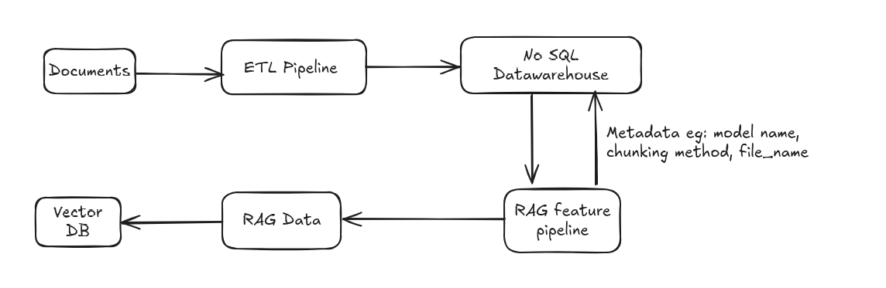

# Agentic RAG System


# Project Setup

1. Use uv to manage dependencies
    * To intialize new project:
    ```
    uv init
    ```

    * To create virtual environment from pyproject.toml file
    ```
    uv sync
    ```


2. Use python 3.12

3. [ruff](https://docs.astral.sh/ruff/) as liner and code formatter.

    ```
    uv add --dev ruff
    ```


# Objective
## 1. Data Pipeline




* API that handle file uploads (.pdf to .txt), extract and chunk the text using either recursive, semtantic or optionally custom chunking logic.
* Generate embeddings and store them in a vector database (Pinecone, Qdrant, Weaviate, or Milvus- FAISS and Chroma are not allowed).
    * All metadata (e.g., file name, chunking method, embedding model used) should be saved in a relational or NoSQL database.


**Tech Stacks:** *ZenML, MongoDB* 

## 2. Agentic Architecture


* The second API is a RAG-based agentic system using LangChain or LangGraph and will not use the RetrievalQA chain. 
    * The agent will reason through tools to answer user queries, utilizing a memory layer (Redis or any other production-grade option) to preserve conversational context. 

    * The agent will also be responsible for interview booking process that captures full name, email, date, and time, sends a confirmation email to your own email [will use SMTP for simple purpose], and stores the booking information in your chosen database. 
    [We will compare different similarity search algorithms supported by vector DB]


**Tech Stacks:** *Langraph, Langchain, MongoDB, QDrant, Langsmith, Redis*

